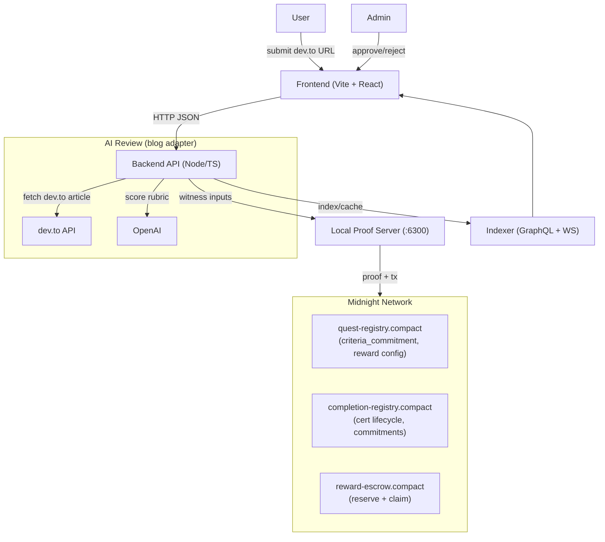

# zk.ly — Zealy, but **proof-first**

----

*Replace “trust me” quests with AI-reviewed, ZK-certified completions on Midnight.*

zk.ly is a **Zealy alternative** where every quest completion can become a **verifiable ZK certificate**—and **AI-reviewed quests are governed and auditable** (no black-box approvals).

Core flow (hackathon scope):

- Technical blog submission → AI rubric review → proof/certificate lifecycle → admin approval → optional escrow claim

Hackathon track:

- **AI Track** (AI-reviewed quests + auditable policy steps)

---

## Preprod deployment

- **Live app (Render)**: `http://zk-ly-615h.onrender.com`
- **Network**: `preprod`
- **Contract addresses**:
  - **Quest Registry**: `2adc5eb8746273a867292697d97f38bb3f183960081f062856c23f272de74187`
  - **Completion Registry**: `e9a7c61d713b77629344c2ed0390ae953396539668f9719f0e1404e2f8452120`
  - **Reward Escrow**: `a4b1ff33ed2b0ed5c67600a47006cc6c229571252ac0b8f1dfb121c8fdaff6d5`

---

## Why this disrupts Zealy

Zealy’s failure modes are not UX bugs—they’re **trust gaps**:

- **Quest farming:** Sybil accounts + unverifiable completions drain rewards.
- **Opaque AI decisions:** rejections are unchallengeable; approvals have no audit trail.
- **Criteria tampering:** rules can change after submissions.
- **Screenshot fraud:** low-cost fabricated evidence beats real builders.

zk.ly fixes this by moving the “truth” into the **proof boundary**:

- Quest criteria are **committed** (hash on-chain; full rules stay private on Midnight).
- Verification outputs (including AI review result) become **witness data** inside the ZK circuit.
- The chain only reveals what’s needed: **a certificate exists**, status, and minimal public fields.

---

## Why Midnight

This product collapses on a fully public chain because:

- Public criteria → creators don’t commit real rules (or adversaries game them).
- Public scores → the system becomes optimizable/farmable.
- Public contribution history → builders avoid participating.

Midnight enables:

- **Private ledger state**: full criteria, review payloads, and sensitive evidence can stay private.
- **Selective disclosure**: publish only commitment hashes and minimal certificate fields.
- **Wallet-led actions**: user/admin approvals can be driven through the DApp Connector model.

---

## Features

- **Quest creation with private criteria commitments**
  - Track tags: `builder`, `educator`, `advocate`, `community-leadership`
  - Reward modes: `xp-only` or `escrow-auto` (automatic escrow reservation + later claim)
- **AI-reviewed dev.to submissions**
  - Fetch dev.to article content
  - Score against rubric (live OpenAI if configured)
  - Produce structured review: score + breakdown + pass/fail + evidence hash
- **Certificate lifecycle**
  - `PENDING_ADMIN → APPROVED/REJECTED → CLAIMED`
  - Separation of “proof submission” from “reward approval” (admin gate)
- **Proof server integration**
  - Runs locally via Docker (`midnightntwrk/proof-server`)
- **Admin console**
  - Review submissions
  - Approve/reject
  - Manage reviewer policies (rubric dimensions + ordered steps)
- **Resilient runtime switches**
  - Contracts can be disabled for local/dev scenarios via `MIDNIGHT_DISABLE_CONTRACTS=1`
  - AI review runs in live mode when `OPENAI_API_KEY` is present

---

## Architecture



---

## End-to-end flow

### User flow (Technical blog quest)

- **Pick a quest** in a Space/Sprint
- **Submit dev.to URL**
- **Backend fetches + reviews**
  - Live OpenAI if `OPENAI_API_KEY` is set
- **User submits proof** (proof server generates witness/proof)
- **Completion becomes `PENDING_ADMIN`**

### Admin flow (approval + optional reward)

- **View pending completion**
- **Approve or reject**
  - Approval transitions the cert to `APPROVED` (or `REJECTED`)
- If `escrow-auto`: user later **claims** reserved reward → `CLAIMED`

---

## Local setup

### Prereqs

- Node.js (repo uses modern Node; Node 20+ recommended)
- Docker (for the proof server)
- The `compact` CLI available in your shell (needed to compile Compact contracts)

### 1) Install dependencies

From repo root, install each workspace:

```bash
cd frontend && npm install
cd ../backend && npm install
cd ../contracts && npm install
```

### 2) Start the proof server (Docker)

```bash
cd contracts
npm run proof-server:start
```

It maps `6300:6300` locally (see `contracts/docker-compose.yml`).

### 3) Start the backend API

```bash
cd backend
npm run dev
```

Defaults to port `8787`.

### 4) Start the frontend

```bash
cd frontend
npm run dev
```

---

## Configuration (env vars)

Backend reads env vars via `dotenv/config`. Common ones:

- **AI**
  - `OPENAI_API_KEY` (required for live AI review)
  - `OPENAI_REVIEW_MODEL` (optional; default is `gpt-4o-mini`)
- **Midnight networking**
  - `MIDNIGHT_NETWORK_ID` (default `preprod`)
  - `MIDNIGHT_INDEXER_URL` / `MIDNIGHT_INDEXER_WS_URL`
  - `MIDNIGHT_RPC_URL`
  - `MIDNIGHT_DISABLE_CONTRACTS=1` to disable contract interactions
  - `MIDNIGHT_TX_SUBMISSION_MODE` (supports `backend-operator` vs connector-led flows)
  - `MIDNIGHT_OPERATOR_SEED` (required only if backend is submitting transactions as operator)

---

## Contracts & proof logic

See `contracts/README.md` for:

- What each Compact contract does
- Proof boundary and what is public vs private
- Constraints/assumptions for hackathon scope

---

## Repo structure

- `frontend/` — Vite + React dApp and admin console
- `backend/` — API, in-memory store, AI review adapter, Midnight integration toggles
- `contracts/` — Compact contracts + deploy/CLI helpers + proof server compose

---

**“zk.ly replaces Zealy’s trust gap: governed AI reviews your submission, and Midnight issues a ZK certificate proving you met the quality bar—without revealing your identity, raw score, or private criteria.”**

